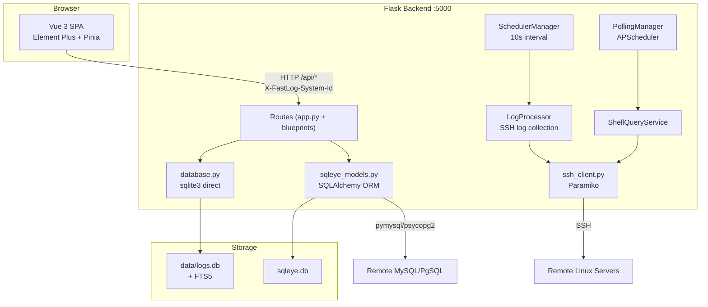

# Rebuild FastLog/Spotter System

The `rebuild.md` describes a remote log collection, search, and analysis system with an integrated SqlEye subsystem. The repo currently only has infrastructure scaffolding (`requirements.txt`, Dockerfile, CI). All application code must be written.

## Architecture Overview

## Phase 1: Backend Foundation

Create the core backend infrastructure files.

- `**[backend/config.py](backend/config.py)**`: Global config constants (DB paths, default SSH settings, scheduler intervals, logging config). Read env vars like `DATA_DIR`, `MAIN_DB_NAME`, `SQLEYE_DB_NAME`, `SCHEDULER_ENABLED`.
- `**[backend/database.py](backend/database.py)**`: sqlite3 direct operations. `init_db()` creates all 8 tables (`systems`, `logs`, `logs_fts`, `file_states`, `config`, `search_configs`, `log_views`, `log_view_timeline_notes`, `shell_queries`, `shell_query_history`) with WAL mode + 30s busy_timeout. CRUD functions for each table. FTS5 virtual table creation and sync.
- `**[backend/init_progress.py](backend/init_progress.py)**`: Singleton `InitProgressManager` storing per-`task_id` progress dicts in memory (`running`/`completed`/`error` states with `total_files`, `processed_files`, `total_matches`, `current_file`, `percentage`).
- `**[backend/app.py](backend/app.py)**`: Flask main app. CORS setup. `before_request` middleware to extract `X-FastLog-System-Id` into `flask.g.system_id`. Static file serving for production. Register SqlEye blueprints. Start scheduler and polling manager. Health check at `/api/health`. All core API routes (logs, config, systems, views, timeline notes, shell queries, search configs). Logging with `RotatingFileHandler` (hourly, 10 files, 50MB each).

## Phase 2: SSH and Log Processing

- `**[backend/ssh_client.py](backend/ssh_client.py)**`: Paramiko wrapper class. `connect()`, `execute_command()`, `read_file_from_position()`, `list_files()`, `test_connection()`, `close()`.
- `**[backend/log_processor.py](backend/log_processor.py)**`: `LogProcessor` class handling:
  - `initialize()` — full scan of remote log directory, filter by time range, grep/match keywords, extract context lines, insert into DB + FTS5, parse `printed_at`
  - `incremental_update()` — read from last position per file_state, same matching logic
  - `incremental_update_with_configs()` — process all enabled `search_configs`
  - Time parsing for glog/ISO/compact formats
- `**[backend/scheduler.py](backend/scheduler.py)**`: `SchedulerManager` daemon thread, runs every 10s, iterates all systems, calls `LogProcessor.incremental_update()`, uses threading lock.
- `**[backend/shell_query_service.py](backend/shell_query_service.py)**`: Execute shell commands via SSH, diff output line-by-line, handle `ignore_patterns`, generate `diff_lines_json`.

## Phase 3: SqlEye Subsystem

- `**[backend/sqleye_config.py](backend/sqleye_config.py)**`: SqlEye-specific config (env vars for field search workers, batch sizes, TTL).
- `**[backend/sqleye_db.py](backend/sqleye_db.py)**`: SQLAlchemy engine + session factory for `sqleye.db`.
- `**[backend/sqleye_models.py](backend/sqleye_models.py)**`: ORM models: `Session`, `QueryTask`, `QueryHistory`, `FieldSearchTask`.
- `**[backend/sqleye_workspace.py](backend/sqleye_workspace.py)**`: Helper to bind system_id to SqlEye session (one session per workspace).
- `**[backend/sqleye_services/db_connector.py](backend/sqleye_services/db_connector.py)**`: MySQL/PgSQL connection factory using pymysql/psycopg2.
- `**[backend/sqleye_services/query_executor.py](backend/sqleye_services/query_executor.py)**`: Execute SQL, return column names + rows.
- `**[backend/sqleye_services/diff_detector.py](backend/sqleye_services/diff_detector.py)**`: Hash-based diff detection, generate `diff_markers` (added_rows, different_rows with different_columns).
- `**[backend/sqleye_services/polling_manager.py](backend/sqleye_services/polling_manager.py)**`: APScheduler `BackgroundScheduler`, register/remove interval jobs for SQL and Shell queries dynamically.
- `**[backend/sqleye_routes_sessions.py](backend/sqleye_routes_sessions.py)**`: Blueprint for `/api/sql/sessions` CRUD + test.
- `**[backend/sqleye_routes_queries.py](backend/sqleye_routes_queries.py)**`: Blueprint for `/api/sql/queries` CRUD + execute + history.
- `**[backend/sqleye_routes_field_search.py](backend/sqleye_routes_field_search.py)**`: Blueprint for `/api/sql/field-search` — tasks CRUD, execute search, background job polling.

## Phase 4: Frontend Setup

- `**[frontend/package.json](frontend/package.json)**`: Vue 3, Vite 5, Element Plus, Pinia, Axios, @vitejs/plugin-vue.
- `**[frontend/vite.config.js](frontend/vite.config.js)**`: Port 3000, proxy `/api` to `localhost:5000` with 120s timeout.
- `**[frontend/index.html](frontend/index.html)**`: SPA entry point with `
`.
- `**[frontend/src/main.js](frontend/src/main.js)**`: Create Vue app, install Pinia, install Element Plus (full import), mount to `#app`.

## Phase 5: Frontend API Layer and Stores

- `**[frontend/src/api/api.js](frontend/src/api/api.js)**`: Axios instance, base URL `/api`, 30s default timeout (120s for log queries). Request interceptor injects `X-FastLog-System-Id` from `localStorage`. Response interceptor extracts `.data`. Export all core API functions (logs, config, systems, views, timeline notes, shell queries, search configs, background tasks, health).
- `**[frontend/src/api/sqlSessions.js](frontend/src/api/sqlSessions.js)**`: SQL session API calls.
- `**[frontend/src/api/sqlQueries.js](frontend/src/api/sqlQueries.js)**`: SQL query task API calls.
- `**[frontend/src/api/shellQueries.js](frontend/src/api/shellQueries.js)**`: Shell query API calls.
- `**[frontend/src/api/sqlFieldSearch.js](frontend/src/api/sqlFieldSearch.js)**`: Field search API calls.
- `**[frontend/src/stores/sessionStore.js](frontend/src/stores/sessionStore.js)**`: Pinia store for SQL sessions.
- `**[frontend/src/stores/queryStore.js](frontend/src/stores/queryStore.js)**`: Pinia store for SQL queries + history + results.
- `**[frontend/src/stores/shellQueryStore.js](frontend/src/stores/shellQueryStore.js)**`: Pinia store for Shell queries.
- `**[frontend/src/stores/fieldSearchStore.js](frontend/src/stores/fieldSearchStore.js)**`: Pinia store for field search tabs (persistent + temporary).

## Phase 6: Frontend Components

- `**[frontend/src/App.vue](frontend/src/App.vue)**`: Root component. Header with logo, system selector dropdown (create/rename/delete), settings. `el-tabs` for 9 modules. Backend connectivity check on mount.
- `**[frontend/src/components/LogViewPane.vue](frontend/src/components/LogViewPane.vue)**`: Container with view tabs (card style, closable), view CRUD, search box integration, log list, timeline notes dialog trigger.
- `**[frontend/src/components/LogList.vue](frontend/src/components/LogList.vue)**`: Table with selection, pagination (10/20/50/100/200/500), columns (ID, file path, line number, printed_at, log_content with `<pre>` max-height 200px, notes, actions). Highlight logic (search term yellow + custom multi-color). Batch notes editing. Notes-only filter. Toggleable columns.
- `**[frontend/src/components/SearchBox.vue](frontend/src/components/SearchBox.vue)**`: Input for `;`-separated keywords, search/clear buttons, auto-save to view config.
- `**[frontend/src/components/ConfigPanel.vue](frontend/src/components/ConfigPanel.vue)**`: Form for SSH config, log directory, search text, time range, context lines. Buttons: save, test connection, reinitialize (with progress dialog), dedupe, delete all.
- `**[frontend/src/components/AppendLogPanel.vue](frontend/src/components/AppendLogPanel.vue)**`: Form for append search text, context before/after, time range, dedupe toggle. Execute with progress.
- `**[frontend/src/components/SearchConfigPanel.vue](frontend/src/components/SearchConfigPanel.vue)**`: Table of multi-search configs (CRUD, enable/disable toggle). Execute all enabled with progress.
- `**[frontend/src/components/SqlConnectionConfigPanel.vue](frontend/src/components/SqlConnectionConfigPanel.vue)**`: Form for DB connection (name, type MySQL/PgSQL, host, port, user, password, database). Save + test.
- `**[frontend/src/components/SqlQueryPanel.vue](frontend/src/components/SqlQueryPanel.vue)**`: Task tabs, SQL editor textarea, execute/save/polling controls, history sidebar (260px), result table with dynamic columns and diff highlighting.
- `**[frontend/src/components/ShellQueryPanel.vue](frontend/src/components/ShellQueryPanel.vue)**`: Task tabs, command textarea, execute/save/polling, ignore patterns, history sidebar, diff views (changed-lines table + side-by-side), full output.
- `**[frontend/src/components/SqlFieldSearchPanel.vue](frontend/src/components/SqlFieldSearchPanel.vue)**`: Task tabs with move left/right, expression input, value match toggle, execute/save, results grouped by exact match / value match in collapsible panels, cell double-click creates temp search.
- `**[frontend/src/components/BackgroundTasksPanel.vue](frontend/src/components/BackgroundTasksPanel.vue)**`: Tables showing scheduler status, SQL polling tasks, Shell polling tasks. Auto-refresh every 10s.
- `**[frontend/src/components/TimelineNotesDialog.vue](frontend/src/components/TimelineNotesDialog.vue)**`: Dialog with timeline notes list (title, content, tags), CRUD.

## Phase 7: Integration and Polish

- Update `**[docker/Dockerfile](docker/Dockerfile)**` if needed (current version expects `frontend/package.json` and `backend/app.py` which will now exist).
- Verify `docker-compose build && docker-compose up` works end-to-end.
- Ensure Flask serves built frontend static files in production mode.
- Add `**[frontend/public/site.webmanifest](frontend/public/site.webmanifest)**` for PWA support.
- Add default system insertion on first startup.
- Auto-create "default view" when no views exist.
- Startup auto-initialization logic (first scan).
- Log rotation setup (hourly, max 10 files, max 3 hours retention, 50MB per file).
- FTS5 migration scripts: `**[backend/migrate_fts.py](backend/migrate_fts.py)**`, `**[backend/rebuild_fts5.py](backend/rebuild_fts5.py)**`.

## Key Implementation Notes

- **No Vue Router**: All navigation via `el-tabs` in `App.vue`.
- **System ID propagation**: `localStorage` -> Axios interceptor -> `X-FastLog-System-Id` header -> `flask.g.system_id`.
- **Dual databases**: `data/logs.db` (raw sqlite3) and `backend/sqleye.db` (SQLAlchemy).
- **FTS5 search**: INTERSECT strategy for multi-keyword, fallback to LIKE.
- **Async tasks**: `threading.Thread(daemon=True)` for reinitialize/append/multi-search, progress via `InitProgressManager`.
- **Diff detection**: Hash-based for SQL results, line-by-line for Shell output.

