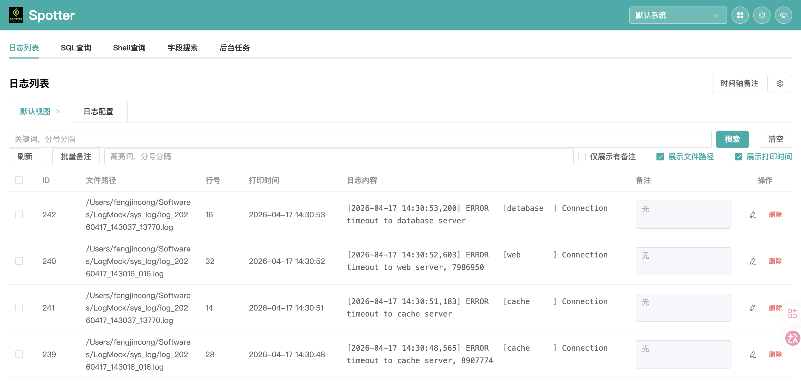
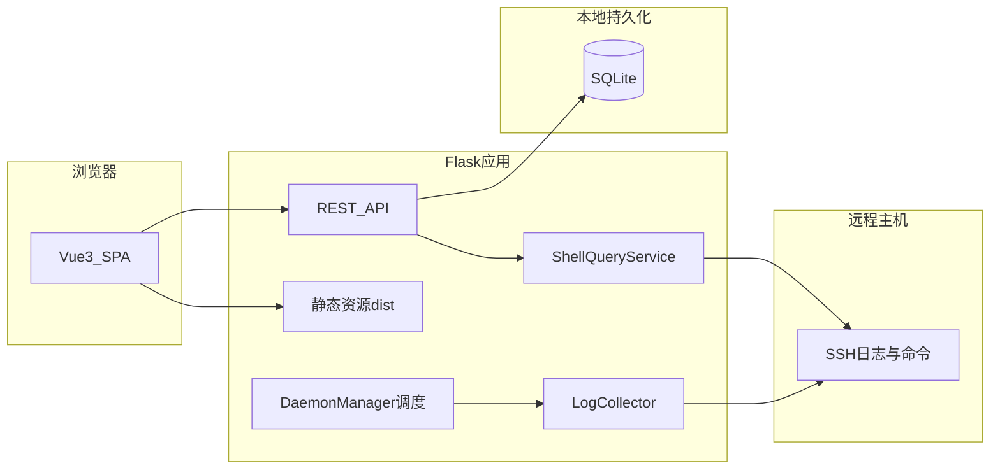

# Spotter

Spotter 是一套面向远程服务器日志的采集、检索与辅助分析工具：通过 SSH 连接目标主机，按配置对日志目录做增量采集与关键字筛选，将结果落库后在 Web 界面中浏览、标注与扩展查询；并集成 SQL 会话与查询、Shell 命令轮询等能力，便于在排障场景中统一查看日志与数据库侧信息。

---

## 项目简介

本仓库为前后端一体应用：**前端**为 Vue 3 + Vite + Element Plus 单页应用；**后端**为 Flask，使用 SQLite 存储日志与配置，通过 Paramiko 进行 SSH 日志拉取与解析，可选后台调度器持续采集。生产环境可将前端构建产物由 Docker 多阶段构建打入同一镜像，由 Gunicorn 托管静态资源与 API。



---

## 项目介绍

- **定位**：为运维与开发人员提供可配置的远程日志「监视器」，支持多系统（`X-FastLog-System-Id` 区分）、多搜索配置、重新初始化与追加采集等流程，并记录采集进度与后台任务状态。
- **技术栈**：Python 3.11+（推荐）、Flask、SQLAlchemy、APScheduler、Paramiko；Node.js 20+（前端开发与构建）；可选 Docker / Docker Compose 一键部署。
- **数据**：默认在项目 `data/` 目录下使用 `logs.db`（主库）及 `sqleye.db`（SQL 相关功能），可通过环境变量覆盖路径与库名。

---

## 业务介绍

1. **日志采集**：配置 SSH 主机、日志目录、搜索关键字与时间范围等，后台按间隔执行 tail/cat 等策略，将匹配行写入本地数据库并支持全文检索相关能力（见 `fastlog` 模块）。
2. **日志管理**：列表筛选、单条/批量删除、按内容去重、备注、追加扫描任务及进度查询与取消。
3. **多系统与多配置**：维护多套「系统」与多条「搜索配置」，主配置与多搜索配置采用不同轮询间隔，减轻 SQLite 锁竞争。
4. **日志视图与时间线备注**：自定义视图与关联备注，便于按事件串联分析。
5. **SqlEye**：数据库连接、会话、SQL 执行与字段搜索等 API（`/api/sql/*`），辅助在排障时对照库表数据。
6. **Shell 查询**：保存并在远程周期执行 Shell 命令，查看历史输出（见 `ShellQueryService` 与相关 API）。

---

## 软件架构



- **表现层**：`frontend/` 构建后为 SPA，开发态由 Vite 代理或直连后端 API；生产态由 Flask 同进程提供静态文件与 `/api/*`。
- **应用层**：`backend/app.py` 注册路由、健康检查、CORS、日志落盘；蓝图挂载 SqlEye 相关路由。
- **领域层**：`fastlog`（采集、SSH、数据库、调度、初始化进度）、`sqleye`（连接、查询执行、字段搜索、会话路由）。
- **基础设施**：SQLite 文件库、Rotating 文件日志、环境变量驱动的 `config.py`。

---

## 目录结构说明

| 路径 | 说明 |
|------|------|
| `backend/` | Flask 应用根目录：`app.py` 入口与路由，`config.py` 环境配置，`requirements.txt` 依赖，`fastlog/` 日志采集与调度，`sqleye/` SQL 辅助模块，`logs/` 运行日志（如 `app.log`）。 |
| `frontend/` | Vue 3 工程：`src/App.vue` 主界面，`src/components/` 各功能面板（配置、日志列表、追加日志、SQL、Shell 等），`src/api/` 与 `src/stores/` 请求与状态，`public/` 静态资源。 |
| `docker/` | `Dockerfile` 多阶段构建（前端 build + Python 运行时），`build_image.sh` 构建脚本，`docker-compose.yml` 本地/服务器编排示例。 |
| `scripts/` | 辅助脚本：API 冒烟测试、连接验证等（按需使用）。 |
| `data/` | 默认数据目录（运行时生成或挂载），存放 `logs.db` 等；勿将敏感凭据提交到版本库。 |

仓库中若存在与业务无关的临时文件或本地导出页面，可加入 `.gitignore` 以免干扰协作。

---

## 环境与启动命令

### 前置条件

- Python 3.11+（与 Docker 镜像一致可减少差异）
- Node.js 20+（仅本地开发前端时需要）

### 后端（开发）

```bash
cd backend
python -m venv .venv
source .venv/bin/activate   # Windows: .venv\Scripts\activate
pip install -r requirements.txt
# 可选：复制或设置环境变量，见下文「环境变量」
python app.py
```

默认监听 `http://0.0.0.0:5000`（见 `config.py` 中 `HOST` / `PORT`）。

### 前端（开发）

```bash
cd frontend
npm ci
npm run dev
```

按 Vite 控制台提示访问；请配置与后端同源或代理，以便调用 `/api/*`。

### 前端构建 + 后端托管静态（本地联调）

```bash
cd frontend && npm ci && npm run build
# 将 dist 产物部署到 backend 期望的 static 目录策略与当前项目一致时，由 Flask 提供 SPA
```

具体静态目录以 `app.py` 中 `Flask(..., static_folder="static")` 为准；Docker 构建会将 `dist` 复制到 `/app/static`。

### Docker

```bash
# 自仓库根目录构建（与脚本一致）
bash docker/build_image.sh

# 或使用 Compose（端口 5000，数据挂载示例见 compose 文件）
docker compose -f docker/docker-compose.yml up --build
```

镜像内进程示例：`gunicorn` 单 worker、多线程，绑定 `0.0.0.0:5000`。

---

## 使用docker来启动容器服务

### 1. 构建镜像

在仓库根目录执行（与 [`docker/build_image.sh`](docker/build_image.sh) 一致）：

```bash
bash docker/build_image.sh
```

若 BuildKit 拉取失败，可参考下文「常见问题与排查」使用 `DOCKER_BUILDKIT=0` 构建。

### 2. 打包为镜像文件（便于拷贝分发）

**压缩包（体积较小）：**

```bash
docker save spotter:latest | gzip > spotter-latest.tar.gz
```

**未压缩 tar（与下文 `docker load -i` 兼容性最好）：**

```bash
docker save spotter:latest -o spotter-latest.tar
```

### 3. 加载镜像

从 gzip 包加载（你本地的 Docker 若支持直接读取该格式，可使用）：

```bash
docker load -i spotter-latest.tar.gz
```

成功时终端可能显示：

```text
Loaded image: spotter:latest
```

若 `docker load -i` 对 `.tar.gz` 报错，可改用管道解压后加载：

```bash
gunzip -c spotter-latest.tar.gz | docker load
```

从**未压缩**包加载（兼容性最好）：

```bash
docker load -i spotter-latest.tar
```

同样会出现 `Loaded image: spotter:latest` 一类提示。

### 4. 使用镜像启动容器

将本机目录挂载到容器内数据卷 `/data`（与镜像内 `DATA_DIR` 一致），映射 Web 端口 `5000`：

```bash
docker run -d --name spotter -p 6066:5000 \
  -v "$(pwd)/data:/data" \
  -e DATA_DIR=/data \
  -e SQLEYE_DB_PATH=/data/sqleye.db \
  -e SCHEDULER_ENABLED=true \
  spotter:latest
```

启动后在浏览器访问 `http://localhost:5000`。停止与删除示例：

```bash
docker stop spotter && docker rm spotter
```

---

## 环境变量（常用）

| 变量 | 含义 |
|------|------|
| `HOST` / `PORT` | 服务监听地址与端口 |
| `DATA_DIR` | 主数据目录（默认项目下 `data/`） |
| `MAIN_DB_NAME` / `SQLEYE_DB_NAME` | 主库与 SqlEye 库文件名 |
| `SQLEYE_DB_PATH` | SqlEye 库绝对路径（可覆盖默认） |
| `APIEYE_DB_NAME` / `APIEYE_DB_PATH` | API 查询（Header 与子任务历史）独立 SQLite 库；默认 `backend/apieye.db`，生产可设为 `/data/apieye.db` |
| `SCHEDULER_ENABLED` | 是否自动启动后台采集调度（本地调试可设为 `false`） |
| `SCHEDULER_INTERVAL_SECONDS` / `SCHEDULER_SEARCH_CONFIG_INTERVAL_SECONDS` | 主轮询与多搜索配置轮询间隔（秒） |
| `DEBUG` | `true` 时 Flask 调试模式（仅开发） |

默认值参见 [`backend/config.py`](backend/config.py)。

---

## 常见问题与排查

1. **无法连接 Docker**：确认本机 Docker Desktop（或 daemon）已启动后再执行 `docker build` / `docker compose`。
2. **BuildKit 拉取 `docker/dockerfile:1` 失败**：若镜像加速源不稳定，可临时使用经典构建器：`DOCKER_BUILDKIT=0 docker build -f docker/Dockerfile -t spotter:latest .`（与 `build_image.sh` 等价参数，仅构建器不同）。
3. **SSH 连接失败**：检查 `DEFAULT_SERVER_*` 或界面中服务器配置、网络与安全组、目标机 `sshd` 与用户权限。
4. **SQLite 锁或采集卡顿**：生产镜像已采用单 worker Gunicorn；避免多进程同时写同一库文件；可适当调大搜索配置轮询间隔。
5. **健康检查**：`GET /api/health` 返回 JSON 表示服务正常；Compose 中 healthcheck 亦依赖该接口。

---

## 许可证与贡献

若仓库根目录未附带 `LICENSE` 文件，请由项目维护者补充；欢迎通过 Issue / Pull Request 反馈问题与改进建议。
# Spotter
